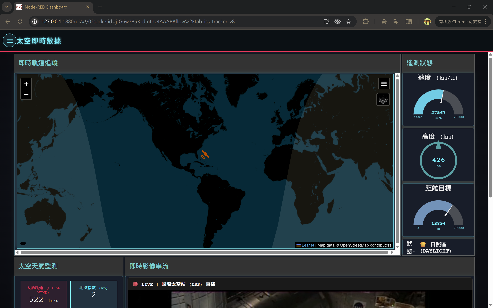
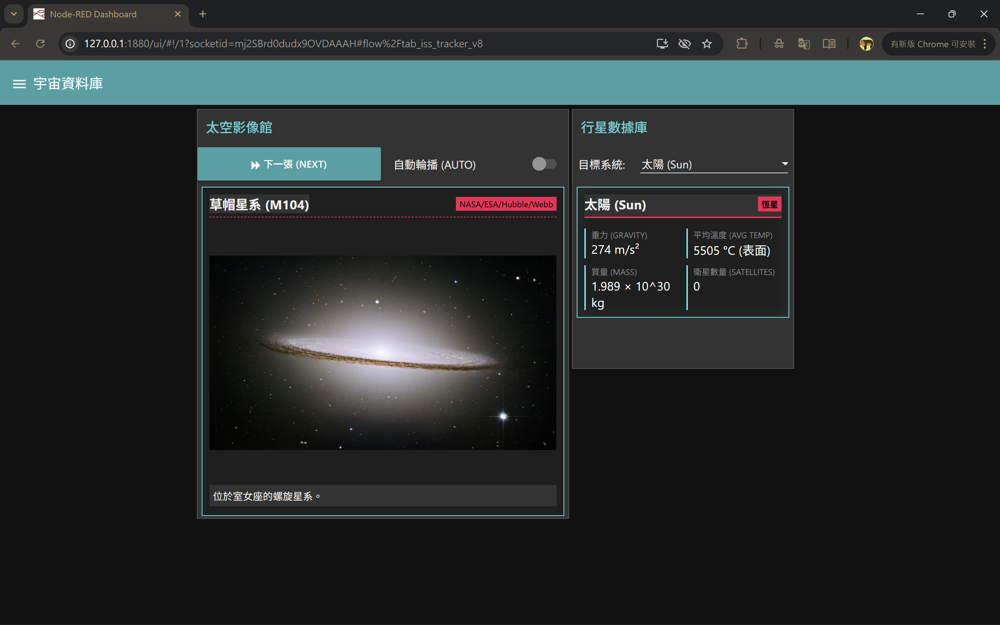
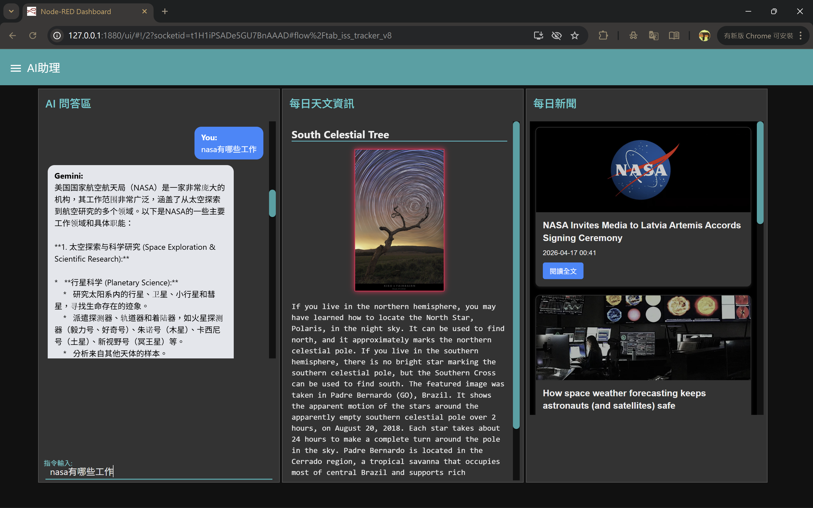

# 醫用資訊系統：太空指揮中心與 AI 儀表板

<p align="left">
  <a href="https://nodejs.org/"></a>
  <a href="https://nodered.org/"></a>
  <a href="https://angularjs.org/"></a>
  <a href="LICENSE"></a>
</p>

## 關於本專案 (About)

本專案為中山醫學大學醫學資訊學系 **「醫用資訊系統分析與設計」** 課程之大三課程實作。專案核心基於 **Node-RED** 事件驅動架構，展示了異質系統串接、多源 API 通訊以及前端 UI 動態渲染。雖然主題為「太空探索與指揮中心」，但其底層架構（即時數據追蹤、影像輪播、API 排程抓取、AI 助理）可平行轉移至醫療健康諮詢、生理數據監測等醫資領域。

## 專案檔案布局 (Project Structure)

```text
.
├── Space_AI_Dashboard.json    # Node-RED 核心流程佈署檔 (包含 UI 與 API 邏輯)
├── package.json               # Node.js 專案設定與套件相依清單
├── .gitignore                 # Git 忽略檔案設定 (防止金鑰外洩)
├── LICENSE                    # MIT 授權條款
└── README.md                  # 專案說明文件
```

## 核心模組與技術棧 (Core Features & Tech Stack)

* **ISS 即時軌道追蹤 (Live Tracker)**：介接 `WhereTheISS API`，利用 `web-worldmap` 渲染即時地圖，並實作經緯度距離運算與狀態切換推播。
* **AI 智能對話助手 (Gemini 2.5)**：整合大語言模型 API 處理非同步 JSON 請求，透過 AngularJS 雙向綁定保存對話，並具備防呆與輸入框自動清空迴路。
* **宇宙資料庫與影像館**：實作狀態機邏輯控制「自動輪播」影像展示，介接 NASA APOD 與 Mars Rovers API。
* **多源情報匯流網**：排程抓取 Spaceflight News 航太新聞與 Open-Notify 在軌人員名單，並透過 Function 節點進行資料清洗 (Data Cleansing)。

## 快速部署指南 (Quick Start)

1. 確保本地端已安裝 [Node.js](https://nodejs.org/) 與 [Node-RED](https://nodered.org/) 環境。
2. 於本專案目錄下執行 `npm install` 安裝相依套件（如 `node-red-dashboard` (UI 介面核心)和 `node-red-contrib-web-worldmap` (即時地圖套件)）。
3. 啟動 Node-RED 伺服器 (`node-red` 指令)，於編輯介面右側選單點擊 **Import**，匯入 `Space_AI_Dashboard.json`。
4. 雙擊名為「準備 API 請求 (Prep)」的 Function 節點，替換為您的 Google Gemini API Key。
5. 點擊右上角 **Deploy** 進行部署，開啟瀏覽器進入 `http://localhost:1880/ui` 即可檢視儀表板。

## 系統畫面截圖 (Screenshots)







## 授權條款 (License)

本專案採用 [MIT License](LICENSE) 授權。您可以自由使用、修改與散佈此專案內容，但請保留原作者版權聲明。

---
* **開發者**: 江永閎
* **課程名稱**: 醫用資訊系統分析與設計
